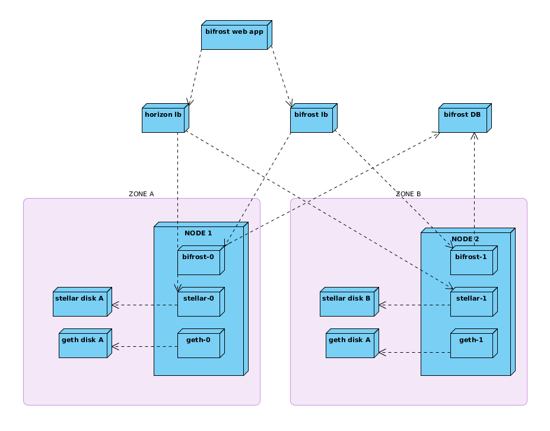

Kind of deployment automation for Bifrost

# Kubernates 
## Component Diagram


## Prerequisites
* `Ansible` >= 2.4
* `google-cloud-sdk` installed, `gcloud` configured to have access the target project
* Create a service account with `Cloud SQL Client` role. Store json-file with private key localy (e.g. in `stellar-sql-client-key.json`)
* Get somewhere SSL certificate and certificate key and store them locally.
  
  Or use existing ones (for test purpose only!):
  * `files/certs/cert.crt`
  * `files/certs/cert.key`

## Configurations
Copy `group_vars/dev.sample` to `group_vars/dev`

Change it. Set appropriate settings.

**CAUTION:** Database in `stellar-core.cfg` must be configures as
```text
DATABASE="__DATABASE_URL__"`
```

## Deployment
Deploy a cluster
```
ansible-playbook -i dev playbooks/deploy-cluster.yml 
```
Deploy all applications in the cluster
```
ansible-playbook -i dev playbooks/deploy-all.yml 
```
Deploy `geth` only
```
ansible-playbook -i dev playbooks/deploy-geth.yml 
```
Deploy `stellar` only
```
ansible-playbook -i dev playbooks/deploy-stellar.yml 
```
It safe to run it several times. The tasks processed before will not block playbook processing.

Drop `geth` only
```
ansible-playbook -i dev playbooks/drop-geth.yml 
```
Drop `stellar` only
```
ansible-playbook -i dev playbooks/drop-stellar.yml 
```
Drop all apps
```
ansible-playbook -i dev playbooks/drop-all.yml 
```

By default `playbooks/drop-*` do not destroy disks and IPs. To force disks deletion use `-e force_disks_drop=1`. To force IPs deletion use `-e force_ips_drop=1`.

Example:
```
ansible-playbook -i dev playbooks/drop-stellar.yml -e force_ips_drop=1 -e force_disks_drop=1
```

Drop the cluster
```
ansible-playbook -i dev playbooks/drop-cluster.yml 
```

## Maintenance

Run in console
```text
kubectl proxy
```

After that a web console available at `http://127.0.0.1:8001/ui` (choose right namespace to see something)

TODO

